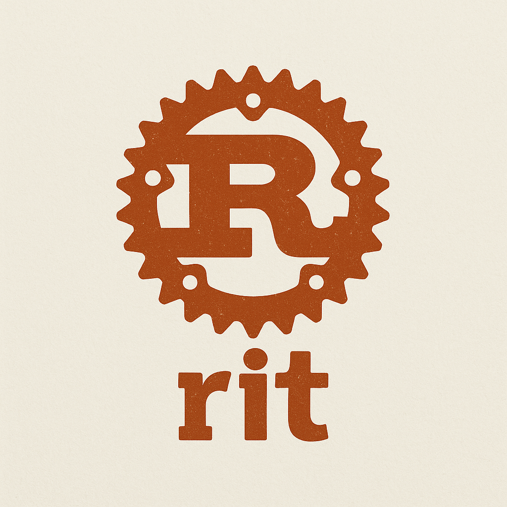

<div align="center">
  
  
  # Rit - A Graphical Git-like Version Control System

  🎨 **Rit** is a educational git-like version control system built in Rust that provides beautiful, graphical representations of repository operations. Perfect for learning version control concepts!

  [](https://opensource.org/licenses/MIT)
  [](https://www.rust-lang.org/)
  [](https://github.com/engineers-hub-ltd-in-house-project/rit)
</div>

## ✨ Features

- **🌳 Graphical Tree Display**: All operations show file and directory structures in beautiful tree format
- **🎨 Colorful Output**: Status-aware colored output for better visualization
- **📁 Smart Ignore Support**: Supports both `.gitignore` and `.ritignore` files
- **🚀 Fast & Lightweight**: Built in Rust for performance
- **📚 Educational Focus**: Designed to help understand version control concepts
- **🔧 Git Compatible**: Works alongside existing git repositories

## 🚀 Installation

### Prerequisites
- Rust 1.70+ installed on your system

### Build from Source
```bash
git clone https://github.com/engineers-hub-ltd-in-house-project/rit.git
cd rit
cargo build --release
cargo install --path .
```

## 📖 Usage

### Initialize a Repository
```bash
rit init
```

### Check Status (Graphical Display)
```bash
rit status
```
Output example:
```
rit status

On branch main

Changes in working directory:
├── ?? .gitignore
├── ?? Cargo.toml
├── ?? src/
│   ├── ?? main.rs
│   └── ?? commands/
│       ├── ?? init.rs
│       ├── ?? status.rs
│       └── ?? add.rs
└── ?? README.md
```

### Add Files
```bash
# Add specific files
rit add README.md

# Add all files
rit add .
```
Output example:
```
Adding files to staging area...

Adding all files in current directory:
├── Added: README.md
├── Added: src/main.rs
├── Added: src/commands/init.rs
├── Added: src/commands/status.rs

Total: 4 files added
```

### Commit Changes
```bash
rit commit -m "Your commit message"
```
Output example:
```
Creating commit...

┌─ Commit Information
│ Message: Your commit message
│ Author:  John Doe <john@example.com>
│ Date:    2024-01-15 14:30:22
│
│ Files in this commit:
├── README.md
├── src/main.rs
├── src/commands/init.rs
└── src/commands/status.rs
└─ Commit created successfully!

Commit hash: a1b2c3d4
```

### View Commit History
```bash
rit log
```
Output example:
```
Commit History

Rit commit history (example):

│ ● a1b2c3d4 Initial commit with rit structure (HEAD)
│ └─ 2 hours ago
│
│ ○ e5f6g7h8 Add graphical status display
│ └─ 1 hour ago
│
│ ○ i9j0k1l2 Implement tree visualization
│ └─ 30 minutes ago

Legend:
● Current HEAD
○ Previous commits
```

## 📁 Ignore Files Support

Rit supports both standard `.gitignore` patterns and custom `.ritignore` files:

### .gitignore
Standard git ignore patterns are respected automatically.

### .ritignore
Create a `.ritignore` file for rit-specific ignore patterns:
```
# Rit specific ignore patterns
*.rit-tmp
*.rit-backup
rit-build/
.rit-cache/

# Development files
*.log
*.tmp
.env.local

# Example: ignore all .bak files
*.bak
```

## 🎓 Educational Purpose

Rit is designed as a **learning tool** to help understand version control concepts:

- **Visual Learning**: See exactly what happens during each git operation
- **Clear Output**: Understand file states and changes with colorful, structured display
- **Safe Environment**: Experiment without affecting your main git workflow
- **Concept Reinforcement**: Each command shows the underlying structure and relationships

## 🛠 Available Commands

| Command | Description |
|---------|-------------|
| `rit init` | Initialize a new rit repository |
| `rit status` | Show working tree status with graphical display |
| `rit add <files>` | Add files to staging area |
| `rit commit -m <message>` | Create a commit with graphical summary |
| `rit log` | Display commit history in graphical format |
| `rit --help` | Show help information |

## 🤝 Contributing

We welcome contributions! This project is designed to be educational and accessible:

1. Fork the repository
2. Create a feature branch (`git checkout -b feature/amazing-feature`)
3. Make your changes with clear, educational intent
4. Add tests if applicable
5. Commit your changes (`git commit -m 'Add amazing feature'`)
6. Push to the branch (`git push origin feature/amazing-feature`)
7. Open a Pull Request

### Areas for Contribution
- Additional graphical visualizations
- More git-like features
- Educational documentation
- Performance improvements
- Cross-platform compatibility

## 📋 Roadmap

- [ ] Branch visualization
- [ ] Merge conflict display
- [ ] Interactive tutorial mode
- [ ] Web-based interface
- [ ] Integration with popular git learning platforms
- [ ] More sophisticated pattern matching for ignore files
- [ ] Diff visualization

## 🔧 Technical Details

- **Language**: Rust 🦀
- **CLI Framework**: clap
- **Colorization**: colored
- **File Walking**: ignore + walkdir
- **Git Integration**: git2
- **Serialization**: serde + serde_json

## 📜 License

This project is licensed under the MIT License - see the [LICENSE](LICENSE) file for details.

## 🙏 Acknowledgments

- Inspired by Git's excellent version control system
- Built for educational purposes to help developers learn version control concepts
- Thanks to the Rust community for excellent crates and tools

---

**🎯 Goal**: Making version control learning visual, intuitive, and fun!

*Happy learning! 🚀* 